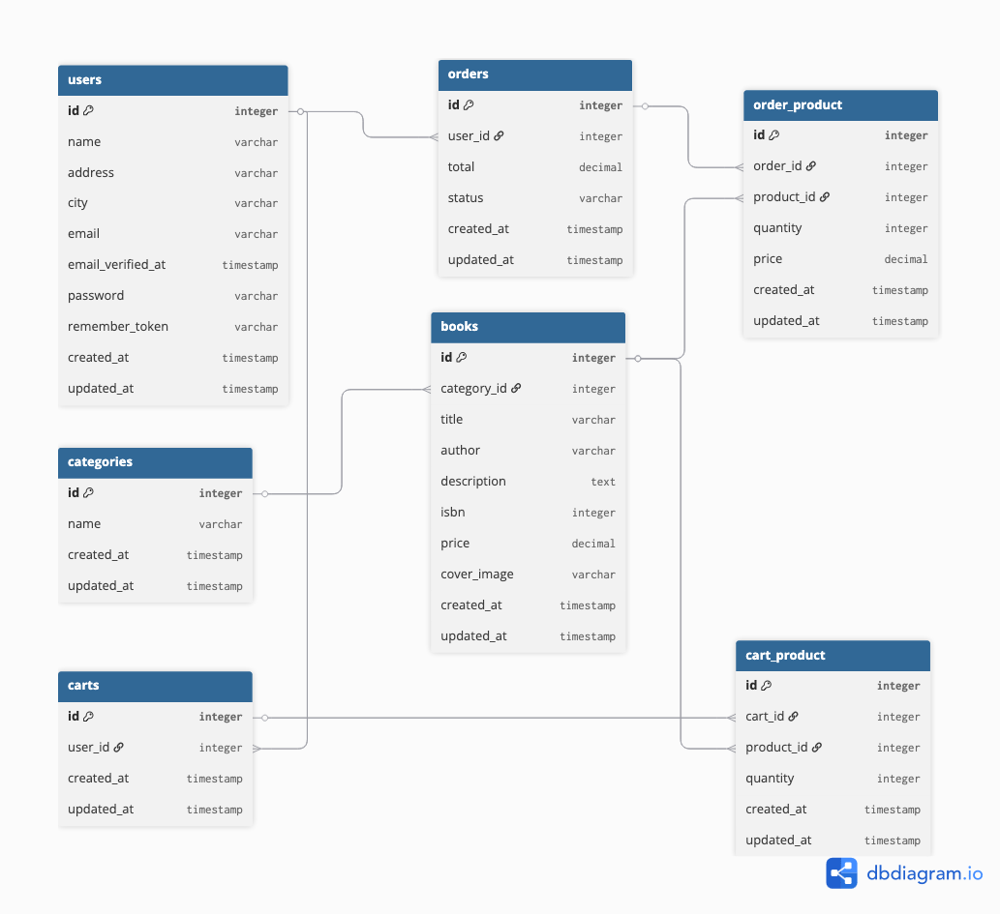

# The Book Shop - Progetto Finale PHP Aulab

## Descrizione

Questo è un progetto di e-commerce per la vendita di libri, sviluppato come esercitazione finale del corso PHP di Aulab. Si tratta di un'applicazione web completa che simula un negozio online di libri con funzionalità di base per utenti e amministratori.

## Funzionalità Principali

### 👥 Gestione Utenti
- **Registrazione e Login**: Sistema di autenticazione completo
- **Profili Utente**: Gestione dati personali e indirizzi
- **Ruoli**: Distinzione tra utenti normali e amministratori

### 📚 Catalogo Libri
- **Homepage**: Visualizzazione degli ultimi 6 libri aggiunti
- **Shop**: Catalogo completo con paginazione (9 libri per pagina)
- **Dettagli Libro**: Pagina dedicata per ogni libro con informazioni complete
- **Categorie**: Filtro libri per genere letterario
- **Ricerca**: Navigazione per categorie tramite dropdown menu

### 🛒 Sistema Carrello e Ordini
- **Carrello**: Aggiunta e gestione prodotti nel carrello
- **Checkout**: Processo di finalizzazione ordine
- **Storico Ordini**: Visualizzazione ordini effettuati dall'utente
- **Conferma Ordine**: Pagina di conferma post-acquisto

### 🔧 Dashboard Amministratore
- **Gestione Libri**: Creazione, modifica e visualizzazione libri
- **Gestione Ordini**: Visualizzazione e modifica stato ordini
- **Gestione Clienti**: Visualizzazione lista clienti
- **Accesso Riservato**: Dashboard visibile solo agli amministratori

### 📄 Pagine Informative
- **FAQ**: Domande frequenti
- **Contatti**: Informazioni di contatto

## Tecnologie Utilizzate

- **Framework**: Laravel (PHP)
- **Frontend**: Blade Templates, Bootstrap 5
- **Database**: MySQL
- **Autenticazione**: Laravel Fortify
- **Componenti Interattivi**: Livewire
- **Icone**: Bootstrap Icons

## Struttura del Progetto

### Controllers
- `PublicController`: Gestione pagine pubbliche (homepage, shop, dettagli libro)
- `CartController`: Gestione carrello e checkout
- `OrderController`: Gestione ordini e storico
- `CategoryController`: Gestione filtri per categoria
- `BookController`: Gestione CRUD libri (admin)
- `DashboardUser`: Dashboard amministratore

### Models
- `User`: Gestione utenti e amministratori
- `Book`: Gestione libri
- `Category`: Gestione categorie
- `Cart` / `Cart_product`: Gestione carrello
- `Order` / `order_product`: Gestione ordini

### Livewire Components
- `AddToCart`: Componente per aggiungere prodotti al carrello
- `CartPage`: Gestione pagina carrello
- `CreateBookForm`: Form creazione libri
- `ListBookForm`: Lista libri per admin
- `ListUsers`: Lista utenti per admin

## Note Importanti

⚠️ **Questo è un progetto didattico** sviluppato per scopi educativi. Alcune funzionalità tipiche di un e-commerce reale non sono state implementate:

- **Gestione Magazzino**: Non è presente il controllo delle quantità disponibili
- **Pagamenti**: Non è integrato un sistema di pagamento reale
- **Spedizioni**: Non è presente la gestione delle spedizioni
- **Inventario**: Non c'è tracciamento delle scorte prodotti

## Crediti

Progetto sviluppato come esercitazione finale del corso PHP di **Aulab**.

---

*Questo progetto è stato creato esclusivamente per scopi didattici e di apprendimento.*
